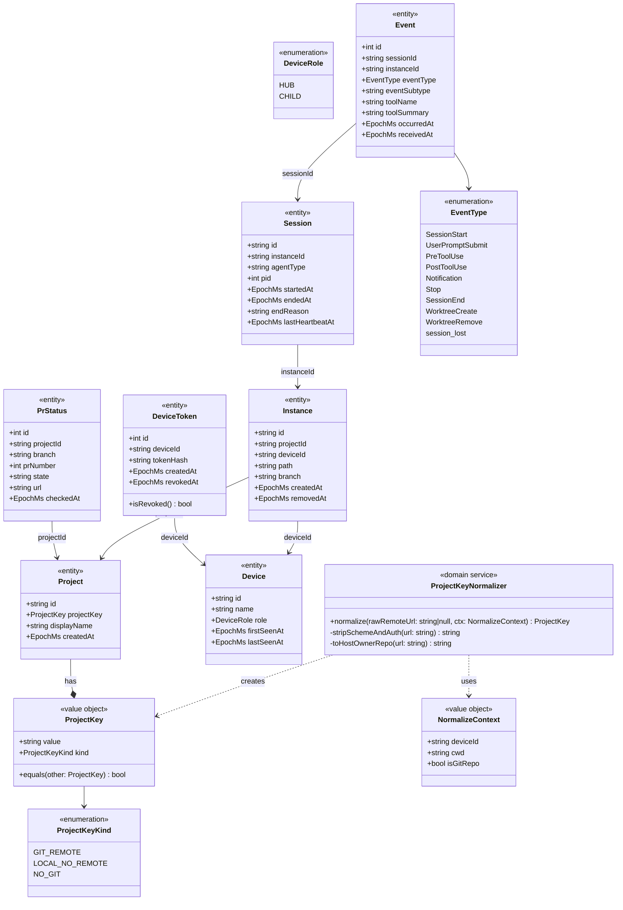
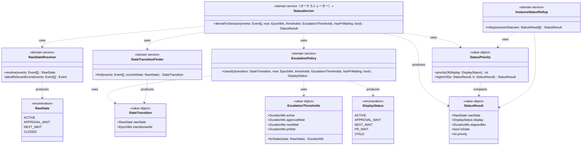
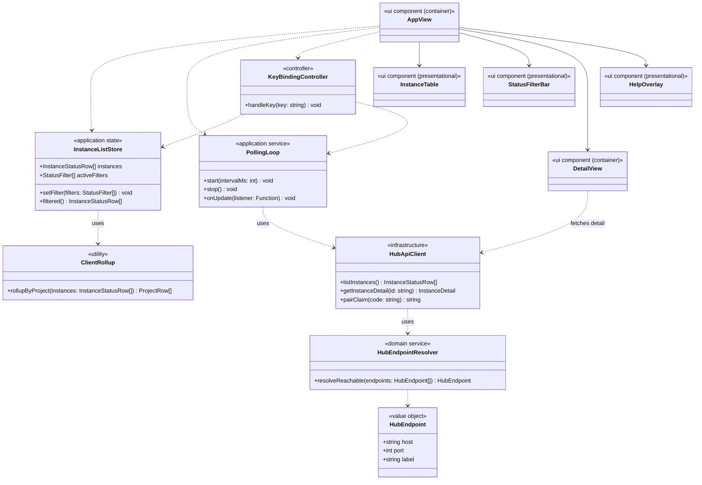

# Monomi v1 — クラス図

`monomi-handoff.md`（特に §0 の確定仕様）に基づく実装設計。レイヤーごとに4枚のクラス図に分けている（命名・型はレイヤー間で一貫）。

**方針**: 独自ロジックが複雑になる箇所（project_key 正規化・status 導出）は god class にせず、責務ごとに値オブジェクト／ドメインサービスへ分解する。Hub API は Controller（薄い）→ UseCase/Service（業務ロジック）→ Repository（永続化）の3層に分離し、Controller に業務ロジックを書かない。CLI は表示・入力処理に専念し、状態導出ロジックを一切持たない。

---

## 1. ドメインモデル（共有の土台）

**責務**: `ProjectKeyNormalizer` が §0.1 の正規化ロジック（scheme/認証除去→host小文字化→末尾`.git`除去→`host/owner/repo`固定、scp形式/URL形式両対応、非remote/非gitは`local:{device_id}:...`/`nogit:{device_id}:...`）を一手に引き受ける。他のどのクラスも正規化の詳細を知らない。

---

## 2. Status 導出エンジン（最も複雑なロジック。5クラスに分解）

**分解の理由**（§0.5 準拠）:

- `RawStateResolver`: session のイベント列から `raw_state` を判定するだけ（`Notification(permission_prompt)→approval_wait`、`Notification(idle_prompt)→next_wait`、`SessionEnd→closed`、それ以外は直近のツール/入力系イベントで `active`）。
- `StateTransitionFinder`: 「現在の raw_state 連続区間の最初のイベント時刻」を探す責務だけを持つ。放置時計が idle 複数発火でリセットされない、という §0.5 の要件はここに閉じ込める。
- `EscalationThresholds`: raw_state 別の放置昇格閾値（active 2h / approval_wait 6h / next_wait 24h / pr_wait 72h、config で上書き可）を保持するだけの値オブジェクト。
- `EscalationPolicy`: 上記2つを使って「放置」に昇格しているかを判定するだけ。PR待ちは `raw_state ≠ active` の時のみ、という §5.2 の分岐もここに閉じる。
- `StatusPriority`: 表示ステータスの優先順位（放置 > 権限待ち > PR待ち > 次の指示待ち > 稼働中）を数値化するだけ。優先順位の定数はここ一箇所にしかない（CLI 側で二重管理しない、§0.5）。
- `StatusDeriver`: 上記を呼ぶだけの薄いオーケストレーター。判断ロジックは一切持たない。
- `InstanceStatusRollup`: 1 instance 配下の複数 session から代表 `StatusResult` を選ぶ（§5.3）。`StatusPriority` に比較を委譲する。

---

## 3. Hub API（Controller → UseCase → Repository の3層）

```mermaid
classDiagram
  class DeviceRepository {
    <<repository>>
    +findById(id: string) Device
    +upsert(device: Device) Device
    +list() Device[]
  }
  class ProjectRepository {
    <<repository>>
    +findOrCreateByKey(key: ProjectKey) Project
    +findById(id: string) Project
  }
  class InstanceRepository {
    <<repository>>
    +upsert(deviceId: string, path: string, branch: string) Instance
    +findById(id: string) Instance
    +listActive() Instance[]
  }
  class SessionRepository {
    <<repository>>
    +upsertStarted(instanceId: string, sessionId: string, occurredAt: EpochMs) Session
    +touchHeartbeat(sessionId: string, at: EpochMs) void
    +markEnded(sessionId: string, reason: string, at: EpochMs) void
  }
  class EventRepository {
    <<repository>>
    +append(event: Event) void
    +allForSession(sessionId: string) Event[]
    +recentForInstance(instanceId: string, limit: int) Event[]
  }
  class TokenRepository {
    <<repository>>
    +findByHash(hash: string) DeviceToken
    +create(deviceId: string, hash: string) DeviceToken
    +revoke(id: int) void
  }
  class PrStatusRepository {
    <<repository>>
    +findByProjectBranch(projectId: string, branch: string) PrStatus
    +upsert(status: PrStatus) void
  }

  class EventIngestionService {
    <<use case>>
    +ingest(payload: RawEventPayload) void
  }
  class InstanceStatusService {
    <<use case>>
    +listInstances(now: EpochMs) InstanceStatusRow[]
    +getInstanceDetail(id: string) InstanceDetail
  }
  class TokenService {
    <<domain service>>
    +issue(deviceId: string) string
    +verify(rawToken: string) Device
    +revoke(tokenId: int) void
    -hash(rawToken: string) string
  }
  class PairingService {
    <<domain service>>
    +startPairing() PairingCode
    +claim(code: string) string
    -registerFailure(code: string) void
  }
  class AuthResolver {
    <<middleware>>
    +resolveDevice(request: HttpRequest) Device
  }

  class HttpServer {
    <<infrastructure>>
    +listen(port: int) void
  }
  class EventsController {
    <<controller>>
    +handlePost(request: HttpRequest) HttpResponse
  }
  class HeartbeatController {
    <<controller>>
    +handlePost(request: HttpRequest) HttpResponse
  }
  class InstancesController {
    <<controller>>
    +handleList(request: HttpRequest) HttpResponse
    +handleDetail(request: HttpRequest) HttpResponse
  }
  class PairController {
    <<controller>>
    +handleStart(request: HttpRequest) HttpResponse
    +handleClaim(request: HttpRequest) HttpResponse
  }
  class DevicesController {
    <<controller>>
    +handleList(request: HttpRequest) HttpResponse
    +handleRevoke(request: HttpRequest) HttpResponse
  }

  EventIngestionService ..> ProjectKeyNormalizer : uses
  EventIngestionService ..> DeviceRepository
  EventIngestionService ..> ProjectRepository
  EventIngestionService ..> InstanceRepository
  EventIngestionService ..> SessionRepository
  EventIngestionService ..> EventRepository

  InstanceStatusService ..> InstanceRepository
  InstanceStatusService ..> EventRepository
  InstanceStatusService ..> StatusDeriver
  InstanceStatusService ..> InstanceStatusRollup
  InstanceStatusService ..> PrStatusRepository

  TokenService ..> TokenRepository
  PairingService ..> TokenService
  AuthResolver ..> TokenService

  EventsController ..> EventIngestionService
  EventsController ..> AuthResolver
  HeartbeatController ..> SessionRepository
  HeartbeatController ..> AuthResolver
  InstancesController ..> InstanceStatusService
  InstancesController ..> AuthResolver
  PairController ..> PairingService
  DevicesController ..> DeviceRepository
  DevicesController ..> TokenService
  DevicesController ..> AuthResolver

  HttpServer ..> EventsController
  HttpServer ..> HeartbeatController
  HttpServer ..> InstancesController
  HttpServer ..> PairController
  HttpServer ..> DevicesController
```

**責務分離**:

- **Controller** は HTTP の入出力変換だけを行い、業務ロジックを一切持たない（`PairController` を除き `AuthResolver` を通す）。
- **UseCase**（`EventIngestionService` / `InstanceStatusService`）が複数リポジトリ・ドメインサービスを束ねる。`EventIngestionService` は §0.1/§0.2 の「reporter は生 remote を送り hub が正規化」「初出自動登録の冪等性（`ON CONFLICT DO NOTHING` / `DO UPDATE SET branch`）」をここで実現する。
- **Repository** は SQL とスキーマ制約（§7.3 + §0.3 の `tokens` テーブル）にのみ責任を持つ。
- **TokenService** と **PairingService** を分離し、「token のハッシュ化・検証・revoke」と「6桁コードの発行・TTL・失敗カウント」を別の責務として扱う（§0.3）。

---

## 4. CLI（Ink。ビジネスロジックを持ち込まない）

**責務分離**:

- `ClientRollup` は hub が返す numeric priority を `max()` するだけ（§0.5）。優先順位の意味は知らない＝ロジックの二重管理をしない。
- `HubEndpointResolver` は §0.2 のマルチエンドポイント方針（LAN IP→Tailscale IP の順次フォールバック）を CLI 側でも再利用する。reporter（bash）側は別途シェルで同等ロジックを実装する（TS 実装の対象外）。
- View は Container（`AppView` / `DetailView`：状態とAPI呼び出しを持つ）と Presentational（`InstanceTable` / `StatusFilterBar` / `HelpOverlay`：propsを描くだけ）に分離。
- CLI は status 導出ロジックを一切持たない。すべて hub 側の `StatusDeriver` / `InstanceStatusRollup` の責務。

---

## 責任分解の一覧表

| クラス                                                                 | レイヤー      | 種別                          | 責務                                                          |
| ---------------------------------------------------------------------- | ------------- | ----------------------------- | ------------------------------------------------------------- |
| ProjectKey                                                             | domain-model  | value object                  | 正規化済みプロジェクト識別子を保持                            |
| ProjectKeyKind                                                         | domain-model  | enum                          | GIT_REMOTE / LOCAL_NO_REMOTE / NO_GIT の判別                  |
| ProjectKeyNormalizer                                                   | domain-model  | domain service                | git remote の表記ゆれを吸収し ProjectKey を生成する唯一の実装 |
| NormalizeContext                                                       | domain-model  | value object                  | 正規化に必要な文脈（device_id, cwd, isGitRepo）               |
| Device / Project / Instance / Session / Event / DeviceToken / PrStatus | domain-model  | entity                        | §7.3 DDL に対応する永続エンティティ                           |
| EventType / DeviceRole                                                 | domain-model  | enum                          | 種別の列挙                                                    |
| RawState / DisplayStatus                                               | status-engine | enum                          | 内部状態／表示状態の列挙                                      |
| RawStateResolver                                                       | status-engine | domain service                | イベント列から raw_state を判定                               |
| StateTransition                                                        | status-engine | value object                  | 現在状態と遷移時刻の組                                        |
| StateTransitionFinder                                                  | status-engine | domain service                | 現在の raw_state 連続区間の開始時刻を特定                     |
| EscalationThresholds                                                   | status-engine | value object                  | raw_state 別の放置昇格閾値                                    |
| EscalationPolicy                                                       | status-engine | domain service                | 放置への昇格判定（PR待ちの`raw_state≠active`条件を含む）      |
| StatusPriority                                                         | status-engine | value object                  | 表示ステータスの優先順位を数値化・比較                        |
| StatusResult                                                           | status-engine | value object                  | 1 session/instance の最終ステータス                           |
| StatusDeriver                                                          | status-engine | domain service（薄い）        | 上記を束ねるオーケストレーター                                |
| InstanceStatusRollup                                                   | status-engine | domain service                | instance 配下の session から代表ステータスを選出              |
| DeviceRepository〜PrStatusRepository                                   | hub-api       | repository                    | SQLite アクセスと冪等性制約                                   |
| EventIngestionService                                                  | hub-api       | use case                      | イベント受信・正規化・自動登録                                |
| InstanceStatusService                                                  | hub-api       | use case                      | 一覧・詳細取得のための status 導出呼び出し                    |
| TokenService                                                           | hub-api       | domain service                | token 発行・検証・revoke                                      |
| PairingService                                                         | hub-api       | domain service                | 6桁コードの発行・TTL・失敗カウント                            |
| AuthResolver                                                           | hub-api       | middleware                    | Bearer token から device 解決                                 |
| HttpServer / *Controller                                               | hub-api       | infrastructure / controller   | HTTP 入出力の薄い変換層                                       |
| HubEndpoint / HubEndpointResolver                                      | cli-ink       | value object / domain service | マルチエンドポイントの到達可否判定                            |
| HubApiClient                                                           | cli-ink       | infrastructure                | hub への HTTP クライアント                                    |
| PollingLoop                                                            | cli-ink       | application service           | watch モードのポーリング制御                                  |
| ClientRollup                                                           | cli-ink       | utility                       | project 単位の priority max() 集計のみ                        |
| InstanceListStore                                                      | cli-ink       | application state             | フィルタ状態・取得結果の保持                                  |
| KeyBindingController                                                   | cli-ink       | controller                    | キー入力→アクションのマッピング                               |
| AppView / DetailView                                                   | cli-ink       | ui component (container)      | 状態とAPIを持つコンテナ                                       |
| InstanceTable / StatusFilterBar / HelpOverlay                          | cli-ink       | ui component (presentational) | 描画のみ                                                      |

---

## 未解決点（実装時に判断）

- `Event` を単一クラス＋`EventType` 判別子にするか、種別ごとの判別ユニオン型（TS discriminated union）にするか。v1 はシンプルさ優先で単一クラス採用、複雑化したら切替を検討。
- `InstanceStatusRollup` のロジックは project レベルのロールアップにも転用可能だが、v1 では project ロールアップを CLI 側の `ClientRollup`（単純 `max()`）に限定する方針とした。将来 instance 側のロールアップ規則が複雑化した場合、共通化するか再検討。
- `EscalationThresholds` の config 上書き（`config.yml` 由来）をどこで読み込み、どの層で DI するか（`HttpServer` 起動時想定）。
- `TokenService.hash` は SHA-256 固定（§0.3）。token 自体は十分なエントロピーを持つランダム値である前提のため、ソルト付きの低速ハッシュ（bcrypt等）は不要と判断——実装時に token 生成の乱数源を確認すること。
