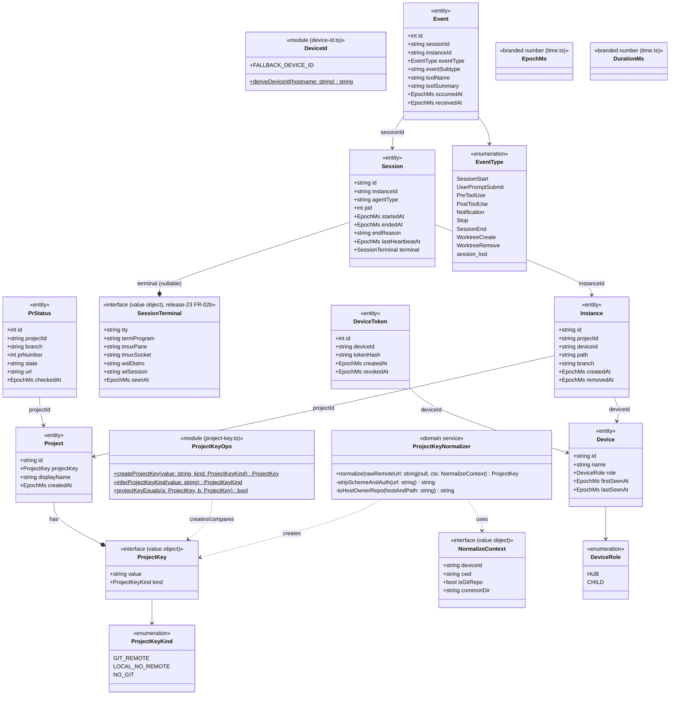

# Monomi v1 — クラス図

[`ARCHITECTURE.md`](../ARCHITECTURE.md)（現状スナップショット）に対応する実装クラス図。release-1〜13 の実装（`src/`）を反映した現況を、レイヤーごとに 4 枚のクラス図＋責任分解表へ分ける（命名・型はレイヤー間およびソースと一貫させる）。命名の変遷など凍結済みの設計経緯は `monomi-handoff.md` を参照。

**方針**: 独自ロジックが複雑になる箇所（project_key 正規化・status 導出）は god class にせず、責務ごとに値オブジェクト／ドメインサービス／モジュール関数へ分解する。Hub API は Controller（薄い）→ UseCase/Service（業務ロジック）→ Repository（永続化）の 3 層に分離し、Controller に業務ロジックを書かない。CLI は表示・入力処理に専念し、状態導出ロジックを一切持たない。エンティティ・DTO・状態は TS の `interface`／判別ユニオンで表し、振る舞いは別のドメインサービス・モジュール関数に置く（データと振る舞いの分離）。

> 図中の `<<module (foo.ts)>>` はクラスではなく当該ファイルが公開するモジュール関数群を表す（`$` は静的／モジュールレベルの目印）。`class Foo~T~` はジェネリック（`Foo<T>`）を意味する。

---

## 1. ドメインモデル（共有の土台）

**責務**: `ProjectKeyNormalizer` が正規化ロジック（scheme/認証除去 → host 小文字化 → 末尾 `.git` 除去 → `host/owner/repo` 固定、scp 形式/URL 形式両対応、非 remote/非 git は `local:{device_id}:...`/`nogit:{device_id}:...`）を一手に引き受ける（`ARCHITECTURE.md` §11）。エンティティ（`Device`〜`PrStatus`）は `src/domain/entities.ts` の TS `interface`（データのみ）で、`ProjectKey` の生成・比較・種別判定は `src/domain/project-key.ts` の関数（`ProjectKeyOps`）へ、device_id 派生は `src/domain/device-id.ts`（`DeviceId`）へ分ける。`EpochMs`/`DurationMs` は `src/domain/time.ts` のブランド型（数値の取り違え防止）。

> **null 許容フィールド**（TS の `| null`）: `Project.displayName`・`Instance.branch`/`removedAt`・`Session.pid`/`endedAt`/`endReason`/`lastHeartbeatAt`/`terminal`・`Event.eventSubtype`/`toolName`/`toolSummary`・`DeviceToken.revokedAt`・`PrStatus.prNumber`/`url`。図では簡潔さのため型に併記していない。token の失効判定は列挙メソッドではなく `revokedAt`（＋ hub 側 `TokenService`）で行う。`SessionTerminal`（release-23 FR-02b）自体も `seenAt` 以外の全フィールド（`tty`/`termProgram`/`tmuxPane`/`tmuxSocket`/`wslDistro`/`wtSession`）が reporter 未捕捉時 null 許容（`Session.terminal` が null か否かとは別に、スナップショットが届いた上で個々の値が取得できなかった場合の null）。

---

## 2. Status 導出エンジン（最も複雑なロジック。責務ごとに分解）

```mermaid
classDiagram
  class RawState {
    <<enumeration>>
    ACTIVE
    APPROVAL_WAIT
    NEXT_WAIT
    CLOSED
  }
  class DisplayStatus {
    <<enumeration>>
    ACTIVE
    APPROVAL_WAIT
    NEXT_WAIT
    PR_WAIT
    STALE
  }
  class RepresentedStatus {
    <<type alias>>
    DisplayStatus_or_CLOSED
  }
  class RawStateRules {
    <<module (raw-state-resolver.ts)>>
    +rawStateOf(event: Event) RawState
    +collectStateBearingDescending(events: Event[]) Event[]
    +compareByReceivedThenId(a: Event, b: Event) int
  }
  class RawStateResolver {
    <<domain service>>
    +resolve(events: Event[]) RawState
  }
  class StateTransition {
    <<interface (value object)>>
    +RawState rawState
    +EpochMs transitionedAt
  }
  class StateTransitionFinder {
    <<domain service>>
    +find(events: Event[], currentState: RawState) StateTransition
  }
  class RunBoundaryScanner {
    <<module (run-boundary-scanner.ts)>>
    +scanForRunBoundary(page: Event[], currentState: RawState|null) RunBoundaryScanResult$
  }
  class RunBoundaryScanResult {
    <<interface>>
    +bool boundaryFound
    +RawState state
  }
  class RunningWorkKind {
    <<enumeration, release-16>>
    workflow
    agent
    skill
  }
  class RunningWork {
    <<interface (value object), release-16. release-18 FR-05: startedAt 追加>>
    +RunningWorkKind kind
    +string name
    +EpochMs startedAt
  }
  class RunningWorkScanResult {
    <<interface (value object), release-16. release-18 FR-04: 非対称境界へ再設計>>
    +RunningWork|null workflow
    +bool sessionEndFound
    +RunningWork|null fallback
    +bool fallbackBoundaryReached
  }
  class RunningWorkResolver {
    <<module (running-work-resolver.ts), release-16. release-18 FR-04: Workflow候補はSessionEndのみで消灯する非対称境界>>
    +scanForRunningWork(page: Event[], carriedFallback: RunningWork|null, carriedFallbackBoundaryReached: bool) RunningWorkScanResult$
    -isSessionEndEvent(event: Event) bool$
    -isFallbackBoundaryEvent(event: Event) bool$
    -runningWorkCandidateOf(event: Event) RunningWork|null$
  }
  class EscalationThresholdValues {
    <<interface (value object)>>
    +DurationMs active
    +DurationMs approvalWait
    +DurationMs nextWait
    +DurationMs prWait
  }
  class EscalationThresholds {
    <<value object (class)>>
    +DurationMs active
    +DurationMs approvalWait
    +DurationMs nextWait
    +DurationMs prWait
    +withDefaults(overrides: Partial~EscalationThresholdValues~) EscalationThresholds$
    +forState(rawState: RawState) DurationMs
  }
  class EscalationPolicy {
    <<domain service>>
    +classify(transition: StateTransition, now: EpochMs, thresholds: EscalationThresholds, hasPrWaiting: bool) RepresentedStatus
  }
  class StatusPriority {
    <<domain service>>
    +priorityOf(display: RepresentedStatus) int
    +higherOf(a: StatusResult, b: StatusResult) StatusResult
  }
  class StatusResult {
    <<interface (value object)>>
    +RawState rawState
    +RepresentedStatus display
    +DurationMs elapsedMs
    +bool isStale
    +int priority
  }
  class StatusDeriver {
    <<domain service (orchestrator)>>
    +deriveForSession(events: Event[], now: EpochMs, thresholds: EscalationThresholds, hasPrWaiting: bool) StatusResult
  }
  class InstanceStatusRollup {
    <<domain service>>
    +rollup(entries: RollupEntry[]) StatusResult
    -selectCandidates(live: RollupEntry[], closed: RollupEntry[], entries: RollupEntry[]) RollupEntry[]
  }
  class RollupEntry {
    <<interface (value object), release-7>>
    +StatusResult status
    +EpochMs lastEventAt
  }

  RawStateResolver ..> RawStateRules : rawStateOf
  StateTransitionFinder ..> RawStateRules : rawStateOf
  StateTransitionFinder ..> StateTransition : produces
  RunBoundaryScanner ..> RawStateRules : rawStateOf
  RunBoundaryScanner ..> RunBoundaryScanResult : produces
  RunningWorkResolver ..> RunningWorkScanResult : produces
  RunningWorkResolver ..> RunningWork : produces
  RunningWorkScanResult --* RunningWork : workflow/fallback (nullable)
  RunningWork --> RunningWorkKind
  StatusDeriver ..> RawStateRules : collectStateBearingDescending
  StatusDeriver ..> RawStateResolver : uses
  StatusDeriver ..> StateTransitionFinder : uses
  StatusDeriver ..> EscalationPolicy : uses
  StatusDeriver ..> StatusResult : produces
  EscalationPolicy ..> EscalationThresholds : uses
  EscalationPolicy ..> StateTransition : uses
  EscalationPolicy ..> RepresentedStatus : produces
  EscalationThresholds ..> EscalationThresholdValues : from
  RawStateResolver ..> RawState : produces
  StatusResult ..> RepresentedStatus
  StatusPriority ..> StatusResult : compares
  InstanceStatusRollup ..> StatusPriority : uses (tie-break only)
  InstanceStatusRollup ..> RollupEntry : uses (recency selection)
  InstanceStatusRollup ..> StatusResult
  RollupEntry ..> StatusResult : wraps
```

**分解の理由**（`ARCHITECTURE.md` §5）:

- `RawStateRules`（`raw-state-resolver.ts` のモジュール関数）: `rawStateOf` が 1 イベント → `raw_state` の写像（`Notification(permission_prompt)→APPROVAL_WAIT`、`Notification(idle_prompt)/Stop→NEXT_WAIT`、`SessionStart/UserPromptSubmit/Pre|PostToolUse→ACTIVE`、`SessionEnd/session_lost→CLOSED`、状態を持たないイベントは `null`）を担う唯一の場所。`collectStateBearingDescending` は状態を持つイベントだけを `received_at` 降順で 1 度だけ抽出し、resolver/finder が同じ配列を共有できるようにする（同一列の重複フルスキャンを集約）。hub レイヤーはこの写像規則を直接 import せず、公開ヘルパー越しにのみ触る。
- `RawStateResolver`: 降順入力の先頭（最新）の `raw_state` を返すだけの薄いラッパ。
- `StateTransitionFinder`: 「現在の raw_state 連続区間の最初のイベント時刻」を探す責務だけを持つ。放置時計が idle 複数発火でリセットされない要件はここに閉じる（`createStateTransition` で凍結した `StateTransition` を返す）。
- `RunBoundaryScanner`（`scanForRunBoundary`）: `received_at` 降順の 1 ページを走査し、現区間と異なる `raw_state` に当たった時点で境界検出を返す。hub の `InstanceStatusService.loadEventsForCurrentRun` がページングを打ち切る判断に使う（全イベント読み込みを避ける最適化）。
- `EscalationThresholdValues` / `EscalationThresholds`: 前者は raw_state 別の放置昇格閾値を持つプレーンな値、後者は凍結クラス（`DEFAULT_ESCALATION_THRESHOLDS` = 2h/6h/24h/72h を `withDefaults` で補完、`forState` で raw_state 別に引ける。`CLOSED` は閾値を持たず例外）。既定値・config 上書きは hub 起動時（`serve`）に注入する。
- `EscalationPolicy`: 上記と遷移時刻から「放置（STALE）へ昇格したか」を判定するだけ。PR 待ちは `raw_state ≠ ACTIVE`（＝待機系）かつ `hasPrWaiting` の時のみ `PR_WAIT`、という分岐もここに閉じ、結果は `RepresentedStatus` を返す。
- `StatusPriority`: 表示ステータスの優先順位を数値化する唯一の場所（`STATUS_PRIORITY`: `CLOSED 0 < ACTIVE 1 < NEXT_WAIT 2 < PR_WAIT 3 < APPROVAL_WAIT 4 < STALE 5`）。`higherOf` は `{ priority, elapsedMs }` を持つ任意型に対するジェネリック比較で、同優先度は経過が長い方を採る。優先順位の定数は CLI 側で二重管理しない。
- `StatusResult`: 1 session/instance の最終ステータス（`interface`）。`createStatusResult` が `priority` を `STATUS_PRIORITY[display]` から埋めて凍結する。
- `StatusDeriver`: `resolver`/`finder`/`policy` を内部に持ち、状態イベントの抽出→ raw_state 判定→遷移時刻→分類→ `StatusResult` 生成を束ねる薄いオーケストレーター。状態を持つイベントが 0 件なら「稼働中・0 経過」に縮退させる。
- `InstanceStatusRollup`: 1 instance 配下の複数 `RollupEntry`（`StatusResult` ＋ 該当 session の直近イベント時刻 `lastEventAt`）から代表 `StatusResult` を選ぶ。release-8 FR-02（B8 対応）で完全 recency 優先へ変更: まず `CLOSED` を、他に live（非 closed）な session が instance 内に 1 つでもあれば `lastEventAt` の新旧に関わらず候補から除外する（§0.5「closed が active を覆い隠さない」不変条件の維持。全 session が closed の場合のみ closed 自身が候補に残る）。残った候補のうち最も新しい `lastEventAt` を持つ session を無条件に代表とし、複数候補が完全同一の `lastEventAt` を持つ場合のみ `StatusPriority.higherOf` でタイブレークする。release-7 FR-01 で導入した「instance 内の最新 `lastEventAt` から 15 分（`STALE_SESSION_THRESHOLD_MS`）以上離れた session を孤立 session として事前除外する」ロジックは release-8 で完全に削除された（recency 優先の下では候補の事前フィルタリングが結果に影響しないため）。`RollupEntry` の組み立て（`lastEventAt` に `loadEventsForCurrentRun` 先頭の `receivedAt` を採用）は呼び出し元の `InstanceStatusService.buildRow` が担う。release-19 FR-01（既知課題 B9 対応）: private `selectCandidates(live, closed, entries)` を新設し、instance 内に `CLOSED` が 1 件以上ある場合に限り「`STALE` 昇格済みかつ最新 `CLOSED` の `lastEventAt` より古い」live session を孤立（zombie）とみなして候補から除外する（除外後 live が 0 件なら最新 `CLOSED` にフォールバック）。真に `ACTIVE`（非 `STALE`）な live session は除外対象にならず B8 の recency 優先化を壊さない。`CLOSED` が皆無の instance は適用範囲外（従来どおり pure recency）。
- `RunningWorkResolver`（release-16、`running-work-resolver.ts`）: 「実行中の作業名（running work）」の区切り判定と作業名選定を1つのモジュールに閉じる。`scanForRunningWork(page, carriedFallback)` は `RunBoundaryScanner.scanForRunBoundary` と同じ「`received_at` 降順の 1 ページを走査し、ページングの継続/打ち切りを呼び出し側に委ねる」構造の姉妹関数だが、打ち切り条件（境界）が異なる: `RawStateRules` の raw_state 遷移ではなく、イベント種別そのもの（`Stop`・`SessionEnd`・`UserPromptSubmit`、および `Notification(idle_prompt)`）を境界とする（`isRunningWorkBoundaryEvent`）。**`RunBoundaryScanner`/`RawStateRules` を再利用しない**のは、`Workflow` 実行中に `permission_prompt`（raw_state の `APPROVAL_WAIT`）を経由して承認 → 再開する run では raw_state 境界（`ACTIVE`→`APPROVAL_WAIT`）がイベント種別境界より先に来てしまい、承認前に開始した Workflow の名前を取りこぼすため。走査ロジック: ページ内で境界イベントに当たれば `{ boundaryFound: true, workflow: null, fallback }` を返し打ち切り（`fallback` を採用）；`PreToolUse(tool_name=Workflow)`（`tool_summary` 非空）が見つかれば降順走査により必ず最新なので即 `{ boundaryFound: false, workflow, fallback }` を返して打ち切り（Workflow 優先。それより後＝スキャン方向で手前に見つかった `Task`/`Agent`/`Skill` では上書きしない。要件 FR-02 AC-2）；`Task`/`Agent`/`Skill`（`tool_summary` 非空）は最初に見つかった（＝最新の）ものだけを `fallback` として保持する。ページが尽きても境界も Workflow も無ければ `fallback` を持ち越して次ページへ（呼び出し側がページング）。`tool_summary` が空・null の該当イベントは候補にしない（AC-6、旧 reporter 互換）。呼び出し元（`InstanceStatusService`）は代表 session の `StatusResult.rawState === 'ACTIVE'` のときのみこの走査を行い（**ACTIVE ゲート**）、非 ACTIVE（`APPROVAL_WAIT`／`NEXT_WAIT`／`CLOSED`）では走査自体を行わず即 `null` を返す（追加のイベント読み取りが発生しないため既知課題 P3 を悪化させない）。要件文書の「消灯は `Stop`/`idle`/`SessionEnd` のみ」（`APPROVAL_WAIT` 中は維持）と「非 ACTIVE なら `null`」は `APPROVAL_WAIT` 待機中に衝突するが、**ACTIVE ゲートを優先し「承認待ち中は `running_work=null`」で確定**（実装・レビューで再度議論しない）。

---

## 3. Hub API（Controller → UseCase → Repository の 3 層）

```mermaid
classDiagram
  class DeviceRepository {
    <<repository>>
    +upsert(device: Device) Device
    +findById(id: string) Device
    +list() Device[]
  }
  class ProjectRepository {
    <<repository>>
    +findOrCreateByKey(key: ProjectKey) Project
    +findById(id: string) Project
    +findByKey(key: string) Project
  }
  class InstanceRepository {
    <<repository>>
    +upsert(projectId: string, deviceId: string, path: string, branch: string|null) Instance
    +findById(id: string) Instance
    +findByDeviceAndPath(deviceId: string, path: string) Instance
    +listActive() Instance[]
    +markRemoved(id: string, at: EpochMs) void
  }
  class SessionRepository {
    <<repository>>
    +upsertStarted(instanceId: string, sessionId: string, startedAt: EpochMs) Session
    +markEnded(sessionId: string, reason: string, at: EpochMs) void
    +updateTerminal(sessionId: string, info: SessionTerminalInput, at: EpochMs) void
    +findById(id: string) Session
    +listByInstance(instanceId: string) Session[]
  }
  class EventRepository {
    <<repository>>
    +append(event: NewEvent) Event
    +allForSession(sessionId: string) Event[]
    +recentForInstance(instanceId: string, limit: int) Event[]
    +recentPageForSession(sessionId: string, limit: int, cursor: EventPageCursor) Event[]
  }
  class TokenRepository {
    <<repository>>
    +findByHash(hash: string) DeviceToken
    +findByDeviceId(deviceId: string) DeviceToken[]
    +create(deviceId: string, hash: string) DeviceToken
    +revoke(id: int, at: EpochMs) void
    +revokeByDeviceId(deviceId: string, at: EpochMs) int
    +listDeviceIdsWithActiveToken() string[]
  }
  class PrStatusRepository {
    <<repository>>
    +findByProjectBranch(projectId: string, branch: string) PrStatus
    +upsert(status: NewPrStatus) PrStatus
  }

  class EventIngestionService {
    <<use case>>
    +ingest(rawPayload: unknown) IngestResult
    -touchDevice(deviceId: string, at: EpochMs) void
  }
  class InstanceStatusService {
    <<use case>>
    +listInstances(now: EpochMs) InstanceStatusRow[]
    +getInstanceDetail(id: string, now: EpochMs) InstanceDetail
    -buildRow(instance: Instance, now: EpochMs) InstanceStatusRow
    -loadEventsForCurrentRun(sessionId: string) Event[]
    -loadRunningWorkForCurrentRun(sessionId: string) RunningWork|null
  }
  class TokenService {
    <<domain service>>
    +issue(deviceId: string) string
    +verify(rawToken: string) Device
    +revoke(tokenId: int) void
    +hasActiveToken(deviceId: string) bool
    +activeDeviceIds() Set
    +revokeAllForDevice(deviceId: string) int
    -hash(rawToken: string) string
  }
  class PairingService {
    <<domain service>>
    +startPairing() PairingCode
    +claim(code: string, device: PairingClaimDeviceInfo) PairingClaimResult
    -registerFailure(now: EpochMs) void
  }
  class AuthResolver {
    <<middleware>>
    +resolveDevice(request: AuthResolvableRequest) Device
  }
  class Loopback {
    <<module (loopback.ts)>>
    +isLoopbackAddress(address: string|null) bool$
  }
  class HubLifecycle {
    <<module (hub-lifecycle.ts), release-18 FR-02>>
    +writeHubPidFile(paths: MonomiPaths, pid: int) void$
    +readHubPidFile(paths: MonomiPaths) int$
    +removeHubPidFile(paths: MonomiPaths) void$
    +isProcessAlive(pid: int, options: ProcessAliveOptions) bool$
    +isPortReachable(port: int, options: PortReachableOptions) Promise$
    +hubStatus(paths: MonomiPaths, port: int, options: HubStatusOptions) Promise$
    +hubStop(paths: MonomiPaths, options: HubStopOptions) Promise$
  }

  class HttpServer {
    <<infrastructure>>
    +listen(port: int, host: string) Promise
    +address() AddressInfo
    +close() Promise
  }
  class createHubServer {
    <<factory>>
    +createHubServer(db: Database, options: HubServerOptions) HttpServer$
  }
  class Router {
    <<infrastructure>>
    +add(method: string, pattern: string, handler, options) Router
    +match(method: string, path: string) RouteMatch
  }
  class EventsController {
    <<controller>>
    +handlePost(req: HubRequest) HubResponse
  }
  class InstancesController {
    <<controller>>
    +handleList(req: HubRequest) HubResponse
    +handleDetail(req: HubRequest) HubResponse
  }
  class PairController {
    <<controller>>
    +handleStart(req: PublicHubRequest) HubResponse
    +handleClaim(req: PublicHubRequest) HubResponse
  }
  class DevicesController {
    <<controller>>
    +handleList(req: HubRequest) HubResponse
    +handleRevoke(req: HubRequest) HubResponse
    -requireLoopback(req: HubRequest) HubResponse
  }

  EventIngestionService ..> ProjectKeyNormalizer : uses
  EventIngestionService ..> DeviceRepository
  EventIngestionService ..> ProjectRepository
  EventIngestionService ..> InstanceRepository
  EventIngestionService ..> SessionRepository
  EventIngestionService ..> EventRepository

  InstanceStatusService ..> InstanceRepository
  InstanceStatusService ..> SessionRepository
  InstanceStatusService ..> EventRepository
  InstanceStatusService ..> ProjectRepository
  InstanceStatusService ..> DeviceRepository
  InstanceStatusService ..> PrStatusRepository
  InstanceStatusService ..> StatusDeriver
  InstanceStatusService ..> InstanceStatusRollup
  InstanceStatusService ..> RunBoundaryScanner : loadEventsForCurrentRun
  InstanceStatusService ..> RunningWorkResolver : loadRunningWorkForCurrentRun (release-16)

  TokenService ..> TokenRepository
  TokenService ..> DeviceRepository
  PairingService ..> TokenService
  PairingService ..> DeviceRepository
  AuthResolver ..> TokenService

  EventsController ..> EventIngestionService
  InstancesController ..> InstanceStatusService
  PairController ..> PairingService
  PairController ..> Loopback : handleStart loopback guard
  DevicesController ..> DeviceRepository
  DevicesController ..> TokenService
  DevicesController ..> Loopback : requireLoopback

  createHubServer ..> Router : wires
  createHubServer ..> HttpServer : builds
  createHubServer ..> AuthResolver
  HttpServer ..> Router : matches
  HttpServer ..> AuthResolver : auth gate (non-public routes)
  Router ..> EventsController
  Router ..> InstancesController
  Router ..> DevicesController
  Router ..> PairController
```

**責務分離**:

- **配線** は `createHubServer`（factory）が担い、Repository → Service → Controller → `Router` を組んで `HttpServer` を返す。閾値（`EscalationThresholds`）と権威時刻（`now`）はここで注入する。
- **認証は `HttpServer` 前段の 1 箇所**で全ルートに適用する（`AuthResolver` で Bearer token → device 解決、無効/失効は 401）。`{ public: true }` の `pair/start`/`pair/claim` だけ認証をスキップし `device: null` で通す。Controller は認証済みリクエストのみを受け取り、個別に `AuthResolver` を持たない（旧図の per-controller 依存は解消）。
- **loopback ガード**は `src/hub/loopback.ts`（`Loopback`）に集約し、`PairController.handleStart`（コード発行を localhost 限定）と `DevicesController`（device 管理を Bearer 認証に上乗せで localhost 限定）が共有する。Controller 間の直 import を避けるための hub 直下モジュール。
- **UseCase**（`EventIngestionService` / `InstanceStatusService`）が複数リポジトリ・ドメインサービスを束ねる。`EventIngestionService` は「reporter は生 remote を送り hub が正規化」「初出自動登録の冪等性」をここで実現する。`InstanceStatusService` は `StatusDeriver`/`InstanceStatusRollup` で状態を導出し、`RunBoundaryScanner` 経由でイベントページングを現在 run 分に絞る。
- **`SessionRepository.updateTerminal`（release-23 FR-02b）**: reporter が捕捉したターミナル特定情報（`tty`/`term_program`/`tmux_pane`/`tmux_socket`/`wsl_distro`/`wt_session`）の最新スナップショットで `sessions` の該当行を無条件上書きする。呼び出し元 `EventIngestionService.ingest()` は `payload.terminal` が undefined/null でないときにのみこれを呼ぶ規約（旧 reporter の欠落ペイロードで既存スナップショットを NULL 上書きしないため、FR-02 AC-5）。`InstanceStatusService.buildRow()` はこの値を `toTerminalDto()`（`dto.ts`）経由で `SessionDto.terminal` へ写し、cli-ink 層の `FocusService`（§4）が `HubApiClient` 経由で読む TerminalDto の発生源になる（cli→hub の依存方向は変わらず、hub 側は `FocusService`/`focus/` を一切 import しない）。
- **Repository** は SQL とスキーマ制約（`ARCHITECTURE.md` §7.3 ＋ `tokens` テーブル）にのみ責任を持つ。イベントは `NewEvent`、PR は `NewPrStatus` を受けて採番済みエンティティを返す。ハートビートは専用ルートを持たず、`POST /api/v1/events`（ハートビート系イベント）として ingest 経路に集約する（旧図の `HeartbeatController` は存在しない）。
- **TokenService / PairingService** を分離し、「token のハッシュ化（SHA-256）・検証・（device 単位の一括）revoke・有効 device 集合の列挙」と「6 桁コードの発行・TTL・失敗カウント・claim 時の device 競合判定」を別の責務として扱う。
- **wire DTO**（`src/hub/dto.ts`）: `InstanceStatusRow`／`InstanceDetail`（`InstanceStatusRow` を継承し `recent_events[]` を追加）／`DeviceDto`／`PairStartResponse`／`PairClaimPayload`・`PairClaimResponse` など。時刻の ISO8601 ⇄ epoch ms 変換（`parseIso8601ToEpochMs`/`epochMsToIso8601`）と表示状態の小文字化（`toWireStatus`）は Controller/DTO 境界で行う。`InstanceStatusRow` は release-16 で `running_work`（`status`／`session` と同じ直下の階層。`SessionDto` へは内包しない）を追加した（一覧・詳細の両方に伝播、`InstanceDetail` は継承のため個別対応不要）。要件定義時点の未解決事項（配置を `InstanceStatusRow` 直下にするか `SessionDto` 内包にするか）はこの直下配置で確定。型 `RunningWork`/`RunningWorkKind` 自体は `dto.ts` ではなく `src/status/running-work-resolver.ts`（status レイヤ）で定義する。release-16 時点では `dto.ts` がこの status レイヤ型をそのまま `InstanceStatusRow.running_work` の wire 型として import し変換ステップを持たなかった（既知課題 A6: `StatusDto`/`StatusResult` の関係と同様の例外と当初文書化していたが、実際には `StatusDto` 側は変換ステップを持つ点で逆のパターンだった）。release-18 FR-05 でこれを解消し、`dto.ts` に wire 型 `RunningWorkDto`（`kind`/`name`/`started_at: string|null`）と変換関数 `toRunningWorkDto(work: RunningWork | null): RunningWorkDto | null` を新設、`InstanceStatusRow.running_work` の型を `RunningWorkDto | null` に変更した。これにより `running_work` も `StatusDto`/`StatusResult` と同じ「status レイヤの型→薄い変換→wire DTO」のパターンに揃い、hub→status の依存方向自体（`dto.ts` が status レイヤの `RunningWork`/`RunningWorkKind` を import する側）は変更していない。`started_at` は {@link RunningWork.startedAt}（採用イベントの `occurredAt`）を `epochMsToIso8601` で ISO8601 化した値で、旧 hub（release-16/17。`started_at` を含まない応答を返す）との混在時の後方互換のため wire 型は `string | null` を許容する。
- **性能（既知課題 P3 との関係）**: `running_work` の導出は `buildRow` が既に算出済みの `StatusResult`（`rawState`）を再利用してゲートするため、非 ACTIVE の instance では追加のイベント読み取りが発生しない（一覧のポーリングごとに全 instance で走る導出処理が P3 を悪化させないための設計判断）。ACTIVE な instance のみ `RunningWorkResolver.scanForRunningWork` 用の専用ページングが走る。
- **`~/.monomi` ホーム・DB ファイルのパーミッション保護**（release-13 FR-01/FR-02、known-issues S1 解決）: home ディレクトリの作成は `ensureMonomiHome()`（`src/config/paths.ts`、定数 `HOME_DIR_MODE = 0o700`）に一本化し、`serve.ts`／`bootstrap.ts`／CLI 側 `pairing-client.ts` の 3 箇所に重複していた `mkdirSync` 呼び出しをこの 1 関数へ集約（DRY）。`mkdirSync` 後に無条件で `chmodSync` するため、新規作成・release-12 以前の既存ディレクトリのどちらでも `0o700` へ揃う（umask 非依存の自動修復）。SQLite DB ファイルは `openDatabase()`（`src/db/database.ts`、定数 `DB_FILE_MODE = 0o600`）が DDL 適用後に無条件で chmod する（`:memory:` は対象外、WAL の `-wal`/`-shm` は親ディレクトリの `0o700` 化で保護される前提）。token/`config.yml` の chmod 600 方針（既存、`ConfigWriter` 参照）と合わせ、`~/.monomi` 配下の機微ファイル・ディレクトリ全体が所有者限定アクセスとなる。
- **hub ライフサイクル管理**（`HubLifecycle`、`src/hub/hub-lifecycle.ts`、release-18 FR-02、既知課題 A7 解消）: `~/.monomi/hub.pid` の書込・削除（`writeHubPidFile`/`removeHubPidFile`）と、pid 生存確認（`isProcessAlive`）＋ port 疎通確認（`isPortReachable`）を突き合わせた3状態判定（`hubStatus`: `running`/`stopped`/`stale`）・生存確認済み pid への SIGTERM 送信＋終了ポーリング（`hubStop`）を1モジュールに集約する。呼び出し元は2方向: (1) `hub/serve.ts` の `serve()`/`close()` が起動成功時・正常終了時に `writeHubPidFile`/`removeHubPidFile` を直接呼ぶ（同一 hub レイヤー内の依存）。(2) `monomi hub status`/`monomi hub stop`（`cli.ts`）が `hubStatus`/`hubStop` を呼ぶ（cli.ts は本図の対象外の起動エントリ、既存の `serve.ts`/`bootstrap.ts` と同様に扱う）。`isPortReachable` は cli-ink 層の `HubEndpointResolver.isReachable`/`HubEndpointOps.localhostEndpoint`（§4）と同じ「GET して応答があれば（ステータス不問で）到達」という判定パターンだが、hub レイヤーが cli レイヤーへ依存しない方針（hub→status の依存方向を保つのと同じ理由）のためこのモジュール内に意図的な別実装として持つ（ロジックの二重実装より依存方向の一貫性を優先）。この `isPortReachable` は cli-ink 層 `HubAutostart`（§4）が唯一 import するクロスレイヤー依存（cli→hub の一方向、hub→cli は無い）。

---

## 4. CLI（Ink。ビジネスロジックを持ち込まない）

```mermaid
classDiagram
  class HubEndpoint {
    <<interface (value object)>>
    +string host
    +int port
    +string label
  }
  class HubEndpointResolver {
    <<domain service>>
    +resolveReachable(endpoints: HubEndpoint[], options: ResolveReachableOptions) HubEndpoint
    -isReachable(endpoint: HubEndpoint, fetchImpl, probePath, timeoutMs) bool
  }
  class HubEndpointOps {
    <<module (hub-endpoint-resolver.ts)>>
    +endpointBaseUrl(endpoint: HubEndpoint) string$
    +localhostEndpoint(port: int) HubEndpoint$
    +parseHubEndpoint(rawUrl: string, defaultPort: int) HubEndpoint$
  }
  class Network {
    <<module (network.ts)>>
    +isTailscaleIpv4(address: string) bool$
    +detectReachableHosts(options: NetworkDetectOptions) NetworkCandidate[]$
    +buildCandidateUrls(port: int, options: NetworkDetectOptions) string[]$
  }
  class NetworkCandidate {
    <<interface>>
    +string host
    +tailscale_or_lan label
  }
  class HubApiClient {
    <<infrastructure>>
    +listInstances() InstanceStatusRow[]
    +getInstanceDetail(id: string) InstanceDetail
    +listDevices() DeviceDto[]
    +revokeDevice(id: string) DeviceRevokeResult
    +pairStart() PairStartResponse
    +pairClaim(payload: PairClaimPayload) PairClaimResponse
  }
  class HubConnection {
    <<interface>>
    +HubApiClient client
    +reresolve() HubApiClient
  }
  class createHubConnection {
    <<factory (hub-api-client.ts)>>
    +createHubApiClient(paths, options) HubApiClient$
    +createHubConnection(paths, options) HubConnection$
  }
  class PollingLoop~T~ {
    <<application service>>
    -bool inFlight
    -HubApiClient client
    +onUpdate(listener: UpdateListener~T~) void
    +onError(listener: ErrorListener) void
    +refresh() Promise
    +start(intervalMs: int) void
    +stop() void
    +isRunning() bool
  }
  class ClientRollup {
    <<utility>>
    +rollupByProject(instances: InstanceStatusRow[]) ProjectRow[]
  }
  class InstanceListStore {
    <<application state>>
    +instances() InstanceStatusRow[]
    +activeFilters() StatusFilter[]
    +setInstances(rows: InstanceStatusRow[]) void
    +setFilter(filters: StatusFilter[]) void
    +toggleFilter(filter: StatusFilter) void
    +clearFilters() void
    +filtered() InstanceStatusRow[]
    +projectRows(rows?: InstanceStatusRow[]) ProjectRow[]
  }
  class StatusDisplay {
    <<module (status-display.ts)>>
    +statusLabel(display: string) string$
    +statusColor(display: string) string$
    +statusGlyph(display: string) string$
    +filterForKey(input: string) StatusFilter$
    +formatAge(seconds: int) string$
    +formatRunningWorkAge(startedAt: string|null) string|null$
    +FILTER_ORDER StatusFilter[]$
  }
  class I18n {
    <<module (i18n/index.ts, release-9)>>
    +t(key: TranslationKey, vars: VarsRecord) string$
    +setActiveLocale(locale: MonomiLocale) void$
    +getActiveLocale() MonomiLocale$
    +resolveLocale(configLocale: MonomiLocale, osLocale: MonomiLocale) MonomiLocale$
  }
  class OsLocale {
    <<module (i18n/os-locale.ts), release-19>>
    +detectLocaleFromEnv(env: ProcessEnv) MonomiLocale|undefined$
  }
  class ViewMode {
    <<type alias>>
    list_or_detail
  }
  class KeyFlags {
    <<interface>>
    +bool upArrow
    +bool downArrow
    +bool leftArrow
    +bool rightArrow
    +bool return
    +bool escape
  }
  class KeyBindingHost {
    <<interface>>
    +moveSelection(delta: int) void
    +openDetail() void
    +back() void
    +toggleHelp() void
    +moveProject(delta: int) void
    +quit() void
    +focusTerminal() void
  }
  class KeyBindingController {
    <<controller>>
    +handleKey(input: string, key: KeyFlags, viewMode: ViewMode) bool
  }
  class ConfigWriter {
    <<module (config/config-writer.ts)>>
    +writeChildPairingConfig(configFile: string, config: ChildPairingConfig) void$
  }
  class PairingClient {
    <<module (pairing-client.ts)>>
    +runHubPair(deps: HubPairDeps) Promise
    +runChildPair(options: ChildPairOptions, deps: ChildPairDeps) Promise
    +normalizeEndpointUrl(input: string, defaultPort: int) string$
  }
  class HubAutostart {
    <<module (hub-autostart.ts), release-18 FR-01>>
    +ensureHubRunning(paths: MonomiPaths, role: MonomiRole, port: int, options: EnsureHubRunningOptions) Promise$
    -spawnHub(paths: MonomiPaths, options: EnsureHubRunningOptions) void$
  }
  class MemoryWatchdog {
    <<module (memory-watchdog.ts), release-20-dashboard-heap-guard>>
    +sample() void
    +start() void
    +stop() void
    +isRunning() bool
    +isStdoutBackpressured(stdout: WritableLengthSource, thresholdBytes: int) bool$
    +DEFAULT_SAMPLE_INTERVAL_MS int$
    +DEFAULT_BACKPRESSURE_THRESHOLD_BYTES int$
    +DEFAULT_BACKPRESSURE_WARN_CONSECUTIVE_COUNT int$
  }
  class WritableLengthSource {
    <<interface>>
    +int writableLength
  }
  class AppView {
    <<ui component (container)>>
  }
  class WatchingIndicator {
    <<ui component (presentational, release-10 FR-02)>>
  }
  class InstanceTable {
    <<ui component (grid container)>>
  }
  class InstanceCard {
    <<ui component (presentational)>>
  }
  class CardGrid {
    <<module (card-grid.ts)>>
    +columnsForWidth(width: int, isTTY: bool) int$
    +MIN_CARD_WIDTH
  }
  class StatusFilterBar {
    <<ui component (presentational)>>
  }
  class DetailView {
    <<ui component (container)>>
  }
  class HelpOverlay {
    <<ui component (presentational)>>
    +HELP_OVERLAY_ROWS int$
  }
  class BoxBorder {
    <<module (box-border.ts, release-6)>>
    +displayWidth(text: string) int$
    +resolveBoxWidth(columns: int, isTTY: bool) int$
    +topBorderWithTitle(width: int, title: string) string$
    +bottomBorderWithLabel(width: int, label: string) string$
    +isFullWidthCodePoint(codePoint: int) bool$
    +truncateToWidth(str: string, maxWidth: int) string$
  }
  class EventScroll {
    <<module (event-scroll.ts, release-6)>>
    +DETAIL_RESERVED_ROWS int$
    +visibleRowsForHeight(rows: int, isTTY: bool, reserved: int) int$
    +clampOffset(total: int, visible: int, offset: int) int$
    +offsetForBottom(total: int, visible: int) int$
    +isAtBottom(total: int, visible: int, offset: int) bool$
    +windowForOffset(total: int, visible: int, offset: int) ScrollWindow$
    +wrapAwareWindowForTexts(texts, contentWidth, visible, offset) ScrollWindow$
    +hardLineAwareWindowForTexts(texts, visible, offset) ScrollWindow$
  }
  class ScrollWindow {
    <<interface>>
    +int startIndex
    +int endIndex
    +int visibleCount
    +string rangeLabel
    +int startSkipHardLines
    +int endSkipHardLines
  }
  class TerminalTitle {
    <<module (terminal-title.ts, release-6 FR-09)>>
    +DEFAULT_TERMINAL_TITLE string$
    +setTerminalTitle(stdout: WritableStream, title: string) void$
  }
  class SanitizeDisplayText {
    <<module (sanitize-display-text.ts)>>
    +sanitizeDisplayText(text: string) string$
    +sanitizeNullableDisplayText(text: string_or_null) string_or_null$
  }
  class TerminalDisplay {
    <<module (terminal-display.ts), release-24 FR-01>>
    +terminalDisplayName(termProgram: string|null, wslDistro: string|null) string|null$
  }
  class TruncatePath {
    <<module (truncate-path.ts), release-24 FR-04>>
    +truncateMiddle(path: string, maxWidth: int) string$
    +collapseHomeDir(path: string) string$
  }
  class MonomiVersion {
    <<module (version.ts, release-11)>>
    +MONOMI_VERSION string$
  }
  class FocusTarget {
    <<interface (value object), release-23 FR-04>>
    +string|null tty
    +string|null termProgram
    +string|null tmuxPane
    +string|null tmuxSocket
    +string|null wslDistro
    +string|null wtSession
  }
  class FocusTargetOps {
    <<module (focus/focus-target.ts)>>
    +toFocusTarget(dto: TerminalDto) FocusTarget|null$
  }
  class FocusResult {
    <<type alias (focus/types.ts)>>
    ok_no_terminal_tmux_detached_not_found_unsupported_platform_error
  }
  class Strategy {
    <<interface (focus/types.ts)>>
    +matchesHint(target: FocusTarget) bool
    +focus(tty: string) Promise
  }
  class TmuxSwitchOutcome {
    <<type alias (focus/types.ts)>>
    ok_with_tty_or_tmux_detached_or_error
  }
  class TmuxStrategy {
    <<interface (focus/types.ts)>>
    +switchClient(target: FocusTarget) Promise
  }
  class WslStrategy {
    <<interface (focus/types.ts)>>
    +focus(tty: string|null) Promise
  }
  class TerminalAppStrategy {
    <<strategy (focus/terminal-app-strategy.ts)>>
  }
  class GhosttyStrategy {
    <<strategy (focus/ghostty-strategy.ts)>>
  }
  class TmuxFocusStrategy {
    <<strategy (focus/tmux-strategy.ts)>>
  }
  class WslFocusStrategy {
    <<strategy (focus/wsl-strategy.ts)>>
  }
  class FocusService {
    <<application service (focus/focus-service.ts), release-23 FR-04>>
    +focus(target: FocusTarget) Promise
  }
  class Osascript {
    <<module (focus/osascript.ts)>>
    +runOsascript(script: string, options: RunOsascriptOptions) Promise$
  }
  class AppleScriptOps {
    <<module (focus/applescript.ts)>>
    +escapeAppleScriptString(value: string) string$
    +quoteAppleScriptString(value: string) string$
  }
  class ExecFileFn {
    <<type alias (DI, hub-autostart.ts SpawnFn パターン踏襲)>>
  }
  note for ExecFileFn "`osascript.ts`・`tmux-strategy.ts`・`wsl-strategy.ts` がそれぞれ独立に同形の `ExecFileFn`（+ 既定実装）を宣言する（共有モジュール化はしていない）。図では1ノードにまとめて表現。"

  HubEndpointResolver ..> HubEndpointOps
  HubEndpointResolver ..> Network : isTailscaleIpv4
  HubEndpointOps ..> Network : isTailscaleIpv4
  HubEndpointOps ..> HubEndpoint
  Network ..> NetworkCandidate
  createHubConnection ..> HubEndpointResolver : resolveReachable
  createHubConnection ..> HubApiClient : builds
  createHubConnection ..> HubConnection : produces
  PollingLoop ..> HubApiClient : FetchFn receives client
  InstanceListStore ..> ClientRollup : uses
  KeyBindingController ..> InstanceListStore
  KeyBindingController ..> StatusDisplay : filterForKey
  KeyBindingController ..> KeyBindingHost : dispatches to
  KeyBindingController ..> KeyFlags
  MemoryWatchdog ..> WritableLengthSource
  AppView ..> InstanceListStore
  AppView ..> PollingLoop
  AppView ..> KeyBindingController
  AppView ..> MemoryWatchdog : isStdoutBackpressured
  AppView ..|> KeyBindingHost : implements
  AppView --> InstanceTable
  AppView --> StatusFilterBar
  AppView --> DetailView
  AppView --> HelpOverlay
  AppView --> WatchingIndicator
  WatchingIndicator ..> MemoryWatchdog : isStdoutBackpressured
  InstanceTable --> InstanceCard
  InstanceTable ..> CardGrid : columnsForWidth
  InstanceCard ..> StatusDisplay
  InstanceCard ..> SanitizeDisplayText
  InstanceCard ..> TerminalDisplay : device 行併記 (release-24 FR-03, U16)
  InstanceCard ..> TruncatePath : path 行の中間省略 (release-24 FR-05, U18)
  InstanceCard ..> BoxBorder : FALLBACK_BOX_WIDTH (width 未指定時の基準幅)
  StatusFilterBar ..> StatusDisplay
  DetailView ..> HubApiClient : fetches detail
  DetailView ..> PollingLoop : polls detail
  DetailView ..> StatusDisplay
  DetailView ..> BoxBorder : layout
  DetailView ..> EventScroll : scroll window
  EventScroll ..> BoxBorder : displayWidth
  EventScroll ..> ScrollWindow : returns
  DetailView ..> SanitizeDisplayText
  DetailView ..> TerminalDisplay : terminal 行 (release-24 FR-02, U16)
  TruncatePath ..> BoxBorder : displayWidth/truncateToWidth/isFullWidthCodePoint 再利用
  AppView ..> TerminalTitle : FR-09
  TerminalTitle ..> SanitizeDisplayText : sanitizeDisplayText
  AppView ..> MonomiVersion : v{MONOMI_VERSION} header badge
  HelpOverlay ..> MonomiVersion : Monomi v{MONOMI_VERSION} footer line
  AppView ..> FocusService : focusRunner DI (focusTerminal(), release-23 FR-05)
  AppView ..> FocusTargetOps : toFocusTarget (gate before calling focusRunner)
  AppView ..> I18n : t() (focus.* notice text)
  FocusService ..> FocusTarget
  FocusService ..> Strategy : dispatch darwinStrategies (term_program hint order)
  FocusService ..> TmuxStrategy : tmuxPane あれば switchClient() を最優先で呼ぶ
  FocusService ..> WslStrategy : darwin でなく isWsl() なら focus() を呼ぶ
  TmuxStrategy ..> TmuxSwitchOutcome : returns
  TerminalAppStrategy ..|> Strategy : implements
  GhosttyStrategy ..|> Strategy : implements
  TmuxFocusStrategy ..|> TmuxStrategy : implements
  WslFocusStrategy ..|> WslStrategy : implements
  TerminalAppStrategy ..> Osascript
  TerminalAppStrategy ..> AppleScriptOps
  GhosttyStrategy ..> Osascript
  GhosttyStrategy ..> AppleScriptOps
  TmuxFocusStrategy ..> ExecFileFn : own execFile DI (not via Osascript)
  WslFocusStrategy ..> ExecFileFn : own execFile DI (not via Osascript)
  Osascript ..> ExecFileFn : DI (hub-autostart.ts SpawnFn パターン)
  FocusTargetOps ..> FocusTarget : produces (invalid fields degrade to null)
  PairingClient ..> HubApiClient
  PairingClient ..> Network : buildCandidateUrls
  PairingClient ..> ConfigWriter : writeChildPairingConfig
  StatusDisplay ..> I18n : statusLabel resolves via t()
  AppView ..> I18n : t() (error prefix)
  DetailView ..> I18n : t() (box titles/labels)
  HelpOverlay ..> I18n : t() (help lines)
  InstanceTable ..> I18n : t() (empty-state label)
  WatchingIndicator ..> I18n : t() (app.watching label)
  HubAutostart ..> I18n : t() (timeout error message)

  note for InstanceTable "既知バックログ A4: 名前が実体（カードグリッド）と不一致、かつ useStdout+columnsForWidth のレイアウト計算を持ち presentational 規約を逸脱。release-5 では解消せず（InstanceCardGrid への改名等は別作業）。"
  note for WatchingIndicator "release-10 FR-02: components/* の慣例（状態を持たない presentational）に対する意図的な例外。1000ms 点滅トグル用の visible state と setInterval をここに閉じ込め、AppView 本体の再レンダーを誘発しない（既知の P4 悪化防止）。"
```

**責務分離**:

- `PollingLoop<T>` は watch モードの汎用ポーリング。取得対象は一覧固有ではなく `FetchFn<T>`（`(client) => Promise<T>`）に委ね、一覧（`(c) => c.listInstances()`）にも詳細（`(c) => c.getInstanceDetail(id)`）にも同じ機構を再利用する。`inFlight` で多重取得を抑止し、`start()` は即時 1 回取得してから間隔ポーリングする（既定 `DEFAULT_POLL_INTERVAL_MS = 3000`）。取得失敗は例外にせず `ErrorListener` へ配り、注入された `ReresolveClient` があれば到達先を選び直して次 tick 以降のクライアントを差し替える（LAN → Tailscale フォールバック）。
- `HubApiClient` は `baseUrl` 非依存の読み取り/管理クライアント（一覧・詳細・devices 一覧/revoke・pair start/claim）。到達先の選定は持たず、`createHubApiClient`/`createHubConnection`（factory）が `HubEndpointResolver` で候補を優先順にプローブして配線する。`createHubConnection` は再解決ファクトリ同梱の `HubConnection` を返し、`PollingLoop` の watch 中フォールバックに供給する。
- `HubEndpointResolver` と `HubEndpointOps`／`Network` がマルチエンドポイント方針（Tailscale `100.64.0.0/10` 優先 → LAN の順、到達可否は HTTP 応答有無で判定）を実装する。`Network` は `monomi hub pair` の候補 URL 提示（`buildCandidateUrls`）にも使う。reporter（bash）側は同等ロジックをシェルで別実装する。
- `PairingClient`（`runHubPair`/`runChildPair`）が §9 のペアリング CLI を実装し、`HubApiClient`（pair start/claim）・`Network`（候補 URL）・`ConfigWriter`（`role`/`hub_endpoints`/`device_id` の部分書き込み、`chmod 600`）を束ねる。
- `HubAutostart`（`ensureHubRunning`、release-18 FR-01、既知課題 A7 解消）は `monomi`（引数なし）実行時にダッシュボード表示前で呼ばれる自己修復自動起動の実体。`role: child` では何もせず（`role` が `child` 以外なら hub 起動対象と見なす）、既に `port` へ疎通できれば何もしない。疎通できなければ自パッケージ内 `dist/bin.js` を `process.execPath` で `hub` サブコマンド付き detached spawn（`unref()` 済み、`spawnHub` private helper）し、stdout/stderr を `~/.monomi/hub.log` へ追記リダイレクトしてリトライ付きで起動完了を待つ（既定 10 秒でタイムアウトし `hub.log` 参照を含む例外を投げる）。疎通確認そのものは hub-api 層 `HubLifecycle.isPortReachable`（§3 参照）を直接 import して使う——これが本図中で唯一の cli-ink→hub-api のクロスレイヤー依存（逆方向の hub→cli 依存は無い）。タイムアウト時のエラーメッセージ整形は他の cli-ink モジュールと同様 `I18n.t()` 経由（`hubLogFile` 参照を含む）。Ink コンポーネント・`HubApiClient` には依存しない（ダッシュボード起動より前段で完結する処理のため）。
- `MemoryWatchdog`（`memory-watchdog.ts`、release-20-dashboard-heap-guard FR-01/FR-02）は稼働監視ログ（`process.memoryUsage()`・`stdout.writableLength`）を `paths.cliLogFile` へ 1 行 1 サンプルで `fs.appendFileSync` 追記する診断専用モジュール。`cli.ts` の `startMemoryWatchdog`（`monomi` 引数なし経路、`runDashboard` 直前）が `new MemoryWatchdog(resolvePaths(), { stdout: process.stdout }).start()` で起動する配線は、`HubAutostart` の `ensureHubRunning` 同様に本図の対象外（cli.ts）が担う。`start()` は即時 1 回 `sample()` してから `intervalMs`（既定 `DEFAULT_SAMPLE_INTERVAL_MS`）ごとに `setInterval` で繰り返し、timer は `unref()` してプロセスの自然終了を妨げない。`sample()` 本体は try/catch で囲み、`ensureMonomiHome`/`appendFileSync` の失敗（ENOSPC・EACCES 等）を握りつぶす——診断ログの記録失敗でダッシュボード本体を落とさないため（AC-4: `process.exit` 等でのプロセス終了は一切行わない）。同モジュールが export する純粋関数 `isStdoutBackpressured(stdout, thresholdBytes)`（`WritableLengthSource` 最小 interface を引数に取る）は `MemoryWatchdog` 自身の WARN 判定（`DEFAULT_BACKPRESSURE_WARN_CONSECUTIVE_COUNT` 回連続超過）に加え、`AppView`（再描画間引き）・`WatchingIndicator`（点滅間引き、release-10 FR-02）からも import され、バックプレッシャー判定基準を1関数に集約する共有依存になっている。
- `KeyBindingController` はキー → アクションの薄い写像に徹する。ビュー状態（選択位置・`ViewMode`）は持たず、`handleKey(input, KeyFlags, viewMode)` の引数で受け取り、画面遷移・選択移動は `KeyBindingHost`（`AppView` が React state で実装）へ委譲する。フィルタキー解決だけ `StatusDisplay.filterForKey` を使う。**`PollingLoop` には依存しない**（watch は常時 ON でトグルを持たないため、旧図の依存エッジは削除）。`handleKey` は release-20-dashboard-heap-guard FR-03 AC-3 で戻り値を `boolean` へ変更した（操作をディスパッチしたか＝ハンドル済みキーだったかを返す）。呼び出し側（`AppView` の `useInput`）はこれが `true` のときのみ再描画トリガー（`bump()`）を呼び、無効キー入力での無駄な再描画を省く。
- `InstanceListStore` は取得結果とフィルタ状態のみを保持し、`filtered()`/`projectRows(rows?)`（`ClientRollup` 委譲）を提供する。`projectRows` の `rows` は省略可能引数（release-20-dashboard-heap-guard FR-03 AC-1）: 呼び出し側が同一レンダー内で既に `filtered()` を呼んでいれば、その結果をそのまま渡すことで内部での再計算（二重の `filtered()` 呼び出し）を避けられる。省略時は従来どおり内部で `filtered()` を呼ぶ。`ClientRollup` は hub が返す numeric priority を `max()` するだけで、優先順位の意味は解釈しない。
- View は Container（`AppView`／`DetailView`: 状態と API 呼び出しを持つ）と Presentational（`InstanceCard`／`StatusFilterBar`／`HelpOverlay`: props を描くだけ）に分離。`AppView` は 1 instance = 1 枚の `InstanceCard` を `InstanceTable`（列数は `CardGrid.columnsForWidth` が端末幅と TTY 判定で決定）で並べる。`DetailView` は自前で `PollingLoop<InstanceDetail>` を張り、`pollIntervalMs` 間隔で `getInstanceDetail` を呼び直して status/イベントタイムラインを自動更新し、アンマウントで確実に停止する。`WatchingIndicator`（release-10 FR-02、`app-view.tsx` から分離）は見た目は presentational だが、この分離規約に対する唯一の意図的な例外として `visible` state と 1000ms `setInterval` を自身に閉じ込める。理由は `AppView` がすでに抱える再レンダー過多（既知バックログ P4）を、点滅の再描画トリガーで悪化させないため（React は子の `setState` だけでは親を再レンダーしない性質を利用）。`isRunning: boolean` を props に取り、`AppView` 本体の state は増やさない。
- 表示語彙（ラベル・色・グリフ・経過時間・フィルタキー対応）は `StatusDisplay`（`status-display.ts`）に集約し、status 導出・優先順位ロジックは CLI に一切持たない。すべて hub 側 `StatusDeriver`／`InstanceStatusRollup` の責務。release-9-i18n 以降、ラベルの文字列自体は `StatusDisplay` が直接持たず `I18n`（`i18n/index.ts`）の `t()` 経由でアクティブロケールに応じて解決する（`StatusDisplay` が持つのは表示状態→翻訳キーの写像と色・グリフ。色・グリフはロケール非依存）。同様に `AppView`／`DetailView`／`HelpOverlay`／`InstanceTable`／`WatchingIndicator` の文言も `t()` 経由。
- `OsLocale`（`i18n/os-locale.ts`, release-19 FR-02）: `LANG` の値を `_`/`.` 区切りで分割し先頭の言語部分が `ja`/`en` ならその値を、それ以外・未設定・`C`/`POSIX` なら `undefined` を返す `detectLocaleFromEnv(env?)` のみを持つ純粋関数モジュール（`LANGUAGE`/`LC_ALL`/`LC_MESSAGES` は参照しない。スコープ外）。`I18n.resolveLocale` はこの結果を第2引数 `osLocale` として受け取れるようシグネチャ拡張された（`configLocale ?? osLocale ?? 'en'`）が、実際に両者をつなぐ配線（`resolveLocale(loadLocaleFromConfig(), detectLocaleFromEnv())`）は本図の対象外の起動エントリ `cli.ts` が担う（`I18n`/`OsLocale` 間に直接の import 依存は無い）。
- release-6 で `DetailView` 用に追加された 4 モジュールは、いずれも React に依存しない純粋関数モジュール（`CardGrid` と同じ思想）。`BoxBorder`（`box-border.ts`）は表示幅計算・タイトル/範囲ラベル埋め込み罫線の生成、`EventScroll`（`event-scroll.ts`）は端末高さ→表示行数・スクロールウィンドウの算出（`DETAIL_RESERVED_BREAKDOWN` の各定数値は AppView/DetailView の JSX 行構成と手動同期が必要な暗黙結合を持つ点に注意）、`TerminalTitle`（`terminal-title.ts`）はターミナルのタブ/ウィンドウタイトル設定（OSC 0）、`SanitizeDisplayText`（`sanitize-display-text.ts`）はレポーター由来の自由記述からの ANSI/制御文字除去を担う。4 モジュールは独立ではなく、`EventScroll` は折り返し幅の見積もりに `BoxBorder.displayWidth`（East Asian Wide 対応の表示桁数計算）を再利用し、`TerminalTitle` はタイトル本文のサニタイズに `SanitizeDisplayText.sanitizeDisplayText` を再利用する（ANSI/制御文字除去ロジックの二重実装を避ける）。
- release-24-dashboard-display-polish で追加された `TerminalDisplay`（`terminal-display.ts`, FR-01）・`TruncatePath`（`truncate-path.ts`, FR-04）も同じく React 非依存の純粋関数モジュール。`TerminalDisplay.terminalDisplayName(termProgram, wslDistro)` は `session.term_program`/`wsl_distro`（wire 値）をターミナルアプリの表示名へ写し、`DetailView`（`detail.terminal` フィールド行、FR-02、既知課題 U16）・`InstanceCard`（`device` 行への `(<terminal>)` 括弧併記、FR-03）の両方から呼ばれる。`TruncatePath.truncateMiddle`（先頭…末尾の中間省略、末尾優先配分）・`collapseHomeDir`（`/Users/<name>`・`/home/<name>` → `~`）は `InstanceCard` の新規 `path` 行（FR-05、既知課題 U18）でのみ使う。両モジュールとも独自の全角判定・切り詰めロジックは持たず、`BoxBorder` が release-24 FR-04 で非公開→ `export` 化した `isFullWidthCodePoint`／`truncateToWidth` を再利用する（判定基準の二重実装を避ける）。
- `SanitizeDisplayText` の呼び出し元は release-10-dashboard-polish のレビュー修正（CWE-150）で `DetailView` に加え `InstanceCard` にも拡大した。`device.name`（両者）・`branch`（`InstanceCard`。`DetailView` の `branch` は release-6 で対応済み）はレポーター元／ペアリング済み child が制御しうる自由記述で、hub 側の検証は型のみのため ANSI エスケープ・制御文字の混入（端末エスケープ注入）を描画直前の除染で防ぐ。
- `MonomiVersion`（`version.ts`, release-11）は `package.json` の `version` を読み込む唯一の入口（`import packageJson from '../package.json' with { type: 'json' }`）。公開 API バレル `src/index.ts` はこの値を re-export するだけで自前定義を持たない。値の定義をバレルから切り出して独立した葉モジュールにしたのは、`AppView`／`HelpOverlay` のような内部コンポーネントが表示用に同じ値を必要とする一方、これらが `index.ts` から直接 import すると `index.ts`（`AppView` を re-export）→ `app-view.tsx` → `index.ts` の循環依存が生じるため（バレルへの逆依存はバレルの「実装詳細の変更を外部へ波及させない」責務を壊す）。`index.ts`／`AppView`／`HelpOverlay` はいずれも `version.ts` を一方向に参照するのみで、`index.ts` 自体は図上のノードを持たない（公開 API の再エクスポート集約であり独自の振る舞いを持たないため）。ヘルプ末尾の表記は en/ja 共通のため `I18n` の `t()` を介さない生文字列。
- **`src/cli/focus/` — フォーカス実行モジュール群（release-23 FR-04、既知課題 U9 解消。詳細は `docs/ARCHITECTURE.md` §14）**: `AppView.focusTerminal()`（`f` キー、`KeyBindingHost` 実装。§10.3）が呼ぶ `FocusService.focus(target)` を頂点に、対象 TTY へ実際にフォーカスを移す一連のモジュール。`FocusTargetOps.toFocusTarget()` が hub API の `TerminalDto`（wire、`SessionDto.terminal`。実体は `hub/dto.ts` の型を re-export し、CLI 側に独自定義は持たない）を厳格検証して `FocusTarget`（camelCase、CLI 内部用）へ写し、不合格フィールドは個別に `null`（情報なし）へ縮退させる（オブジェクト全体は拒否しない）。`AppView` はこの変換結果と `status.display`/`device.id` のゲート判定（§14.2）を経てから `FocusService` を呼ぶ——ゲート判定自体は `FocusService` の責務ではなく host（`AppView`）側に置く設計（`KeyBindingController` が判断を持たないのと同じ「判定は呼び出し側、実行は下位モジュール」の分離）。
  - `FocusService.focus()` のディスパッチは 3 系統に分かれる。**darwin**: `Strategy`（`matchesHint`/`focus(tty)` の共通インターフェイス）実装の `TerminalAppStrategy`／`GhosttyStrategy` を `term_program` ヒント順に総当たり（iTerm2 等の追加はこの配列へ strategy を足すだけで済む、拡張点）。**tmux**: `tmuxPane` があれば他のどの strategy よりも先に `TmuxStrategy`（実装は `TmuxFocusStrategy`）の `switchClient()` を呼び、戻り値 `TmuxSwitchOutcome`（`{ result: 'ok', tty }` か `{ result: 'tmux_detached' | 'error' }` の判別可能ユニオン）で解決した外側クライアントの TTY に差し替えて以降の判定を続ける（tmux ペイン内の pts では外側ターミナルを特定できないため）。**WSL2**: darwin でなく `isWsl()`（`WSL_DISTRO_NAME` または `/proc/version` の `microsoft`）が true なら `WslStrategy`（実装は `WslFocusStrategy`、`matchesHint` を持たず総当たり対象にも含めない）の `focus()` を直接呼ぶ。
  - `TerminalAppStrategy`／`GhosttyStrategy` は `Osascript.runOsascript()`（`execFile` 非 shell 起動、`ExecFileFn` 型で DI 可能。`HubAutostart`（§3）の `SpawnFn` と同じ「実行時は `node:child_process` を注入・テストは mock」パターンを踏襲）と `AppleScriptOps.escapeAppleScriptString()`（AppleScript へ埋め込む文字列の必須エスケープ）を介して `osascript` を起動する。`TmuxFocusStrategy`／`WslFocusStrategy` は AppleScript を使わないため `Osascript` に依存せず、`tmux`／`powershell.exe` をそれぞれ独立宣言の `ExecFileFn`（同形だが共有モジュール化はしていない）経由で直接 `execFile` する。reporter 由来の値（`tty`/`tmux_pane`/`tmux_socket`）は「認証済みだが信頼しない」（既知課題 S9/S12 と同じ脅威モデル）ため、いずれの経路も `FocusTargetOps` の厳格検証・（AppleScript を使う場合のみ）`AppleScriptOps` のエスケープ・`execFile` 非 shell 起動という防御を経て初めて外部プロセスへ渡る。release-24 FR-06（既知課題 B12 解消）: `TerminalAppStrategy`／`GhosttyStrategy` はいずれも対象アプリを実際に操作する前に System Events の `exists process` で起動確認するガードを追加し、未起動なら `not_found` を返して以降の操作（`tell application`/TTY への OSC タグ書き込み）自体を行わない（対象外アプリの意図しない自動起動・タブタイトルの一瞬変化を防止）。`GhosttyStrategy` の `finally` タグ消去は、タグ書き込みに成功した試行が 1 回でもあったときのみ行う（一度も書き込んでいなければ消去自体を省略する）。
  - 本図では cli-ink 層に閉じたモジュール群として表現しており、`hub-api` 層（`SessionRepository.updateTerminal`／`InstanceStatusService.buildRow`、§3）へ直接依存する箇所は無い（`FocusTarget` は `HubApiClient` 経由で取得した `TerminalDto` から都度変換する）。

---

## 責任分解の一覧表

| クラス / モジュール                                                         | レイヤー      | 種別                                                                       | 責務                                                                                                                                                                                                                                                                                                                                            |
| --------------------------------------------------------------------------- | ------------- | -------------------------------------------------------------------------- | ----------------------------------------------------------------------------------------------------------------------------------------------------------------------------------------------------------------------------------------------------------------------------------------------------------------------------------------------- |
| ProjectKey                                                                  | domain-model  | interface (value object)                                                   | 正規化済みプロジェクト識別子（value + kind）を保持                                                                                                                                                                                                                                                                                              |
| ProjectKeyKind / DeviceRole / EventType                                     | domain-model  | enum                                                                       | 種別の列挙（判別ユニオン）                                                                                                                                                                                                                                                                                                                      |
| ProjectKeyOps                                                               | domain-model  | module (project-key.ts)                                                    | ProjectKey の生成・種別判定・等価比較の関数群                                                                                                                                                                                                                                                                                                   |
| ProjectKeyNormalizer                                                        | domain-model  | domain service                                                             | git remote の表記ゆれを吸収し ProjectKey を生成する唯一の実装                                                                                                                                                                                                                                                                                   |
| NormalizeContext                                                            | domain-model  | interface (value object)                                                   | 正規化に必要な文脈（device_id, cwd, isGitRepo, commonDir）                                                                                                                                                                                                                                                                                      |
| DeviceId                                                                    | domain-model  | module (device-id.ts)                                                      | hostname から device_id を派生（`deriveDeviceId`）                                                                                                                                                                                                                                                                                              |
| Device / Project / Instance / Session / Event / DeviceToken / PrStatus      | domain-model  | entity (interface)                                                         | §7.3 DDL に対応する永続エンティティ（データのみ）。release-23 FR-02b: `Session.terminal` を追加                                                                                                                                                                                                                                                 |
| SessionTerminal                                                             | domain-model  | interface (value object), release-23 FR-02b                                | reporter が捕捉したターミナル特定情報（`tty`/`term_program`/`tmux_pane`/`tmux_socket`/`wsl_distro`/`wt_session` ＋受信時刻 `seenAt`）のスナップショット。`Session.terminal`（nullable）                                                                                                                                                         |
| EpochMs / DurationMs                                                        | domain-model  | branded number                                                             | 時刻・期間の取り違え防止のためのブランド型                                                                                                                                                                                                                                                                                                      |
| RawState / DisplayStatus                                                    | status-engine | enum                                                                       | 内部状態／表示状態の列挙                                                                                                                                                                                                                                                                                                                        |
| RepresentedStatus                                                           | status-engine | type alias                                                                 | DisplayStatus ＋ CLOSED（優先度計算・分類結果の型）                                                                                                                                                                                                                                                                                             |
| RawStateRules                                                               | status-engine | module (raw-state-resolver.ts)                                             | イベント → raw_state 写像、状態イベントの降順抽出・比較関数                                                                                                                                                                                                                                                                                     |
| RawStateResolver                                                            | status-engine | domain service                                                             | 降順イベント列の先頭から raw_state を返す薄いラッパ                                                                                                                                                                                                                                                                                             |
| StateTransition / StateTransitionFinder                                     | status-engine | value object / domain service                                              | 現在 raw_state 連続区間の開始時刻を特定                                                                                                                                                                                                                                                                                                         |
| RunBoundaryScanner                                                          | status-engine | module (run-boundary-scanner.ts)                                           | 1 ページを走査し現在 run の状態境界を検出（ページング打ち切り判断）                                                                                                                                                                                                                                                                             |
| EscalationThresholdValues / EscalationThresholds                            | status-engine | value object                                                               | raw_state 別の放置昇格閾値（既定 2h/6h/24h/72h、config 上書き可）                                                                                                                                                                                                                                                                               |
| EscalationPolicy                                                            | status-engine | domain service                                                             | 放置（STALE）への昇格判定、PR 待ち条件を含む                                                                                                                                                                                                                                                                                                    |
| StatusPriority                                                              | status-engine | domain service                                                             | 表示ステータス優先順位の数値化・比較（`higherOf`）の唯一の場所                                                                                                                                                                                                                                                                                  |
| StatusResult                                                                | status-engine | interface (value object)                                                   | 1 session/instance の最終ステータス（`createStatusResult` で凍結）                                                                                                                                                                                                                                                                              |
| StatusDeriver                                                               | status-engine | domain service（オーケストレータ）                                         | resolver/finder/policy を束ねる導出パイプライン                                                                                                                                                                                                                                                                                                 |
| RollupEntry                                                                 | status-engine | interface (value object), release-7                                        | rollup 入力（`StatusResult` ＋ session 直近イベント時刻 `lastEventAt`）                                                                                                                                                                                                                                                                         |
| InstanceStatusRollup                                                        | status-engine | domain service                                                             | instance 配下の session から代表ステータスを選出（release-8 FR-02: 完全 recency 優先。closed は live session があれば除外し §0.5 を維持、priority は同時刻タイブレークのみ。release-19 FR-01/B9: `selectCandidates` が CLOSED 存在時に限り古い STALE な孤立 live session を候補から除外）                                                       |
| RunningWorkKind                                                             | status-engine | enum, release-16                                                           | 実行中の作業の種別（`workflow`/`agent`/`skill`）                                                                                                                                                                                                                                                                                                |
| RunningWork / RunningWorkScanResult                                         | status-engine | interface (value object), release-16                                       | 実行中の作業名（kind + name）／1 ページ走査結果（境界検出可否＋確定 workflow ＋持ち越し fallback）                                                                                                                                                                                                                                              |
| RunningWorkResolver                                                         | status-engine | module (running-work-resolver.ts), release-16                              | raw_state 境界とは別の専用境界（`Stop`/`Notification(idle_prompt)`/`SessionEnd`/`UserPromptSubmit`）でのページ走査＋作業名選定（Workflow優先）を1モジュールに集約                                                                                                                                                                               |
| DeviceRepository〜PrStatusRepository                                        | hub-api       | repository                                                                 | SQLite アクセスと冪等性制約。release-23 FR-02b: `SessionRepository.updateTerminal` がターミナル特定情報の最新スナップショットで無条件上書き                                                                                                                                                                                                     |
| EventIngestionService                                                       | hub-api       | use case                                                                   | イベント受信・正規化・自動登録・冪等 upsert                                                                                                                                                                                                                                                                                                     |
| InstanceStatusService                                                       | hub-api       | use case                                                                   | 一覧・詳細取得のための status 導出／ページング呼び出し。release-16: `buildRow` の ACTIVE ゲート判定を経て `loadRunningWorkForCurrentRun` が `RunningWorkResolver` を呼び出し `running_work` を導出                                                                                                                                              |
| TokenService                                                                | hub-api       | domain service                                                             | token 発行・検証・（device 単位の）revoke・有効 device 集合列挙                                                                                                                                                                                                                                                                                 |
| PairingService                                                              | hub-api       | domain service                                                             | 6 桁コードの発行・TTL・失敗カウント・device 競合判定                                                                                                                                                                                                                                                                                            |
| AuthResolver                                                                | hub-api       | middleware                                                                 | Bearer token → device 解決（HttpServer 前段で全ルートに適用）                                                                                                                                                                                                                                                                                   |
| Loopback                                                                    | hub-api       | module (loopback.ts)                                                       | 送信元が loopback かの判定（pair/start・devices 管理の共有ガード）                                                                                                                                                                                                                                                                              |
| HubLifecycle                                                                | hub-api       | module (hub-lifecycle.ts), release-18                                      | pid ファイル管理（書込/削除）・生存確認＋port 疎通の3状態判定（`hubStatus`）・検証済み SIGTERM 停止（`hubStop`）                                                                                                                                                                                                                                |
| Router                                                                      | hub-api       | infrastructure                                                             | メソッド＋パターンのルート照合（public フラグ付き）                                                                                                                                                                                                                                                                                             |
| createHubServer                                                             | hub-api       | factory                                                                    | Repository→Service→Controller→Router→HttpServer の DI 配線                                                                                                                                                                                                                                                                                      |
| HttpServer                                                                  | hub-api       | infrastructure                                                             | HTTP 入出力・認証ゲート・JSON 変換の薄い層                                                                                                                                                                                                                                                                                                      |
| EventsController / InstancesController / DevicesController / PairController | hub-api       | controller                                                                 | HTTP 入出力の薄い変換（devices/pair は loopback 上乗せ）                                                                                                                                                                                                                                                                                        |
| HubEndpoint / HubEndpointResolver / HubEndpointOps                          | cli-ink       | value object / service / module                                            | マルチエンドポイントの到達可否判定・URL 整形                                                                                                                                                                                                                                                                                                    |
| Network                                                                     | cli-ink       | module (network.ts)                                                        | 到達先候補検出（Tailscale/LAN 分類）と候補 URL 生成                                                                                                                                                                                                                                                                                             |
| HubApiClient / createHubConnection / HubConnection                          | cli-ink       | infrastructure / factory                                                   | hub への HTTP クライアントと到達先配線・再解決ファクトリ                                                                                                                                                                                                                                                                                        |
| PollingLoop<T>                                                              | cli-ink       | application service                                                        | 汎用ポーリング（一覧・詳細）。多重取得抑止・失敗時フォールバック                                                                                                                                                                                                                                                                                |
| ClientRollup                                                                | cli-ink       | utility                                                                    | project 単位の priority max() 集計のみ                                                                                                                                                                                                                                                                                                          |
| InstanceListStore                                                           | cli-ink       | application state                                                          | フィルタ状態・取得結果の保持                                                                                                                                                                                                                                                                                                                    |
| StatusDisplay                                                               | cli-ink       | module (status-display.ts)                                                 | 表示語彙（ラベル/色/グリフ/経過時間/フィルタキー対応）。ラベル文字列は `I18n` の `t()` 経由で解決、色・グリフはロケール非依存                                                                                                                                                                                                                   |
| I18n                                                                        | cli-ink       | module (i18n/index.ts, release-9)                                          | 表示文言解決の唯一の入口（`t`/`setActiveLocale`/`getActiveLocale`/`resolveLocale`）。ロケールはモジュールレベル・シングルトンで保持（React context 不使用）。release-19 FR-02: `resolveLocale` は `configLocale ?? osLocale ?? 'en'` の優先順位で解決するようシグネチャ拡張                                                                     |
| OsLocale                                                                    | cli-ink       | module (i18n/os-locale.ts), release-19                                     | `LANG` 環境変数から `ja`/`en` を判定（`detectLocaleFromEnv`）。`config.locale` 未設定時のみ `I18n.resolveLocale` の `osLocale` 引数として cli.ts が配線（本図では非対象のクロスモジュール wiring）                                                                                                                                              |
| ViewMode / KeyFlags / KeyBindingHost                                        | cli-ink       | type / interface                                                           | キー処理の入出力境界（AppView が Host を実装）。release-23 FR-05: `KeyBindingHost.focusTerminal()` を追加                                                                                                                                                                                                                                       |
| KeyBindingController                                                        | cli-ink       | controller                                                                 | キー入力 → アクションの薄い写像（PollingLoop に非依存）。`handleKey` はディスパッチしたか（`boolean`）を返し、`AppView` の無駄な `bump()` を抑止（release-20 FR-03 AC-3）                                                                                                                                                                       |
| ConfigWriter                                                                | cli-ink       | module (config/config-writer.ts)                                           | child ペアリング設定の部分書き込み（chmod 600）                                                                                                                                                                                                                                                                                                 |
| PairingClient                                                               | cli-ink       | module (pairing-client.ts)                                                 | `monomi hub pair` / `monomi pair` のフロー実装                                                                                                                                                                                                                                                                                                  |
| HubAutostart                                                                | cli-ink       | module (hub-autostart.ts), release-18                                      | `monomi` 起動時の hub 自己修復自動起動（疎通確認→不在なら detached spawn→リトライ疎通待ち）                                                                                                                                                                                                                                                     |
| MemoryWatchdog / WritableLengthSource                                       | cli-ink       | module (memory-watchdog.ts), release-20                                    | 稼働監視ログ（メモリ・stdout backpressure）を1行1サンプルで追記。`isStdoutBackpressured` は AppView/WatchingIndicator とも共有。`sample()` は try/catch で失敗を握りつぶし本体を落とさない（AC-4）                                                                                                                                              |
| AppView / DetailView                                                        | cli-ink       | ui component (container)                                                   | 状態と API を持つコンテナ（DetailView は詳細を自動更新）                                                                                                                                                                                                                                                                                        |
| InstanceTable                                                               | cli-ink       | ui component (grid container)                                              | カードグリッド描画（A4: 命名不一致・レイアウト計算保持の逸脱あり）                                                                                                                                                                                                                                                                              |
| InstanceCard / StatusFilterBar / HelpOverlay                                | cli-ink       | ui component (presentational)                                              | props を描くだけ                                                                                                                                                                                                                                                                                                                                |
| WatchingIndicator                                                           | cli-ink       | ui component (presentational, release-10 FR-02)                            | props を描くだけの規約に対する意図的な例外。1000ms 点滅トグル用の state を自身に閉じ込め、AppView 本体の再レンダーを誘発しない                                                                                                                                                                                                                  |
| CardGrid                                                                    | cli-ink       | module (card-grid.ts)                                                      | 端末幅と TTY からカード列数を算出する純粋関数                                                                                                                                                                                                                                                                                                   |
| BoxBorder                                                                   | cli-ink       | module (box-border.ts, release-6)                                          | BOX幅・タイトル/範囲ラベル埋め込み罫線の生成（表示幅計算含む）。release-24 FR-04: `isFullWidthCodePoint`／`truncateToWidth` を非公開→ `export` 化し `TruncatePath` が再利用                                                                                                                                                                     |
| EventScroll / ScrollWindow                                                  | cli-ink       | module + interface (event-scroll.ts, release-6)                            | 詳細ビューの表示行数・スクロールウィンドウ算出（React 非依存の純粋関数）                                                                                                                                                                                                                                                                        |
| TerminalTitle                                                               | cli-ink       | module (terminal-title.ts, release-6 FR-09)                                | ターミナルのタブ/ウィンドウタイトルを OSC 0 で設定                                                                                                                                                                                                                                                                                              |
| SanitizeDisplayText                                                         | cli-ink       | module (sanitize-display-text.ts)                                          | レポーター由来の自由記述から ANSI/制御文字を除去（注入対策）                                                                                                                                                                                                                                                                                    |
| TerminalDisplay                                                             | cli-ink       | module (terminal-display.ts), release-24 FR-01                             | `term_program`/`wsl_distro`（wire 値）をターミナルアプリの表示名へ写す（`DetailView` の `terminal` 行・`InstanceCard` の `device` 行併記、既知課題 U16）                                                                                                                                                                                        |
| TruncatePath                                                                | cli-ink       | module (truncate-path.ts), release-24 FR-04                                | path の中間省略（`truncateMiddle`、末尾優先配分）・ホームディレクトリ短縮（`collapseHomeDir`）。`InstanceCard` の新規 `path` 行のみが使用（既知課題 U18）                                                                                                                                                                                       |
| MonomiVersion                                                               | cli-ink       | module (version.ts, release-11)                                            | `package.json` の `version` を読み込む唯一の入口。`index.ts`／`AppView`／`HelpOverlay` から一方向に参照される葉モジュール（バレルへの逆依存・循環依存を回避）                                                                                                                                                                                   |
| FocusTarget / FocusTargetOps                                                | cli-ink       | value object / module (focus/focus-target.ts), release-23                  | 検証済みフォーカス対象。`TerminalDto`（wire）を厳格検証し不合格フィールドを個別に `null` へ縮退                                                                                                                                                                                                                                                 |
| FocusResult / Strategy                                                      | cli-ink       | type alias / interface (focus/types.ts), release-23                        | フォーカス実行結果の列挙／darwin strategy 共通インターフェイス（`matchesHint`+`focus(tty)`。TerminalAppStrategy・GhosttyStrategy のみ実装）                                                                                                                                                                                                     |
| TmuxSwitchOutcome / TmuxStrategy / WslStrategy                              | cli-ink       | type alias / interface (focus/types.ts), release-23                        | tmux 切替結果（成功時のみ外側クライアント TTY を伴う判別ユニオン）／tmux・WSL 用の専用インターフェイス（`Strategy` とは別、`matchesHint` を持たない）                                                                                                                                                                                           |
| FocusService                                                                | cli-ink       | application service (focus/focus-service.ts), release-23                   | ディスパッチ（tmuxPane あれば TmuxStrategy.switchClient 優先 → darwin は Strategy[] を term_program ヒント順に総当たり → WSL は WslStrategy.focus → それ以外 unsupported_platform）                                                                                                                                                             |
| TerminalAppStrategy / GhosttyStrategy                                       | cli-ink       | strategy (focus/*.ts), release-23                                          | `Strategy` 実装。Terminal.app（tty 一致タブ選択+前面化）／Ghostty（OSC タイトルタグ+System Events メニュー検索、finally でタグ消去+1回リトライ）。ともに Osascript/AppleScriptOps 経由。release-24 FR-06/B12: 操作前に `exists process` で起動確認するガードを追加し、未起動なら `not_found`（Ghostty はタグ書き込み成功時のみ finally で消去） |
| TmuxFocusStrategy / WslFocusStrategy                                        | cli-ink       | strategy (focus/*.ts), release-23                                          | `TmuxStrategy`/`WslStrategy` 実装。tmux（list-clients+client_activity 最大採用+switch-client）／WSL（powershell.exe で Windows Terminal 前面化、best-effort）。Osascript は使わず各々独立の `ExecFileFn` で `execFile` 直接起動                                                                                                                 |
| Osascript / AppleScriptOps / ExecFileFn                                     | cli-ink       | module / type alias (focus/osascript.ts・focus/applescript.ts), release-23 | `execFile` 非 shell 起動の DI（`ExecFileFn`。osascript.ts/tmux-strategy.ts/wsl-strategy.ts がそれぞれ独立宣言）＋ AppleScript 文字列エスケープ（セキュリティ三段防御の第二・第三段、`ARCHITECTURE.md` §14.3）                                                                                                                                   |

---

## 未解決点・既知バックログ（実装時に判断）

- `Event` は単一 `interface` ＋ `EventType` 判別子を採用（判別ユニオンへの切替は複雑化時に再検討）。
- project レベルのロールアップは CLI 側 `ClientRollup`（単純 `max()`）に限定。instance 側ロールアップ（`InstanceStatusRollup`）と共通化するかは将来判断。
- `EscalationThresholds` の config 上書きは hub 起動時（`serve` → `createHubServer` の `thresholds` 注入）で DI する方針に確定。
- `TokenService.hash` は SHA-256 固定。token 自体が十分なエントロピーを持つ前提のため、ソルト付き低速ハッシュ（bcrypt 等）は用いない。
- **A4（未解消）**: `InstanceTable` はカードグリッドの実体と名前が不一致で、`useStdout()` と列数・幅計算（レイアウトロジック）を保持し presentational 規約を逸脱している。`InstanceCardGrid` への改名、またはレイアウト計算の `card-grid.ts` への集約は、呼び出し側（`app-view.tsx`）の import 変更を伴うためまとまった別作業として行う（`known-issues.md` A4）。
